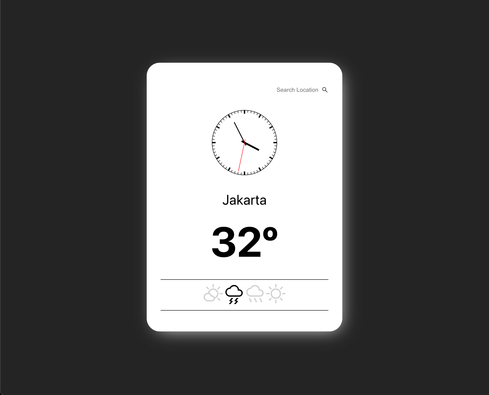

# Live code question 4

1. Given an API handler at `src/services/getWeather.ts`. Please plot the data and create a UI that looks like this image:  

Endpoint:  
> `https://api.openweathermap.org/data/2.5?q={location}&appid={API_KEY}&units=metric` 

Documentation is at:  
> https://openweathermap.org/weather-conditions  

API KEY is inside the `.env.example` file. Please change the name into .env 
 
2. The **clock** and **icons** is optional  
3. Please make it so that the user can input the city name on the input element